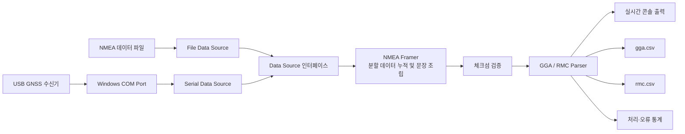

# GNSS Monitor

Windows 환경에서 USB GNSS 수신기의 위치 데이터를 실시간으로 수집하고 분석하는 NMEA 기반 GNSS 모니터링 애플리케이션입니다.

Windows Serial API를 이용한 COM 포트 입력과 NMEA 파일 입력을 지원합니다. 수신 데이터를 NMEA 문장 단위로 조립하고 체크섬을 검증한 뒤 GGA·RMC 데이터를 파싱합니다. 분석한 위치, 위성, 고도 및 이동 정보는 콘솔에 출력하고 CSV 파일로 누적 저장합니다.

## 주요 기능

- Windows COM 포트를 통한 GNSS 데이터 실시간 수신
- 저장된 NMEA 파일을 이용한 데이터 재생 및 검증
- GGA·RMC 문장 파싱
- NMEA 위도·경도를 Decimal Degrees 형식으로 변환
- GGA Fix Quality와 RMC Status를 이용한 Fix / No Fix 판정
- NMEA XOR 체크섬 검증
- 위치·위성 수·HDOP·고도·속도·진행 방향 정보 출력
- 정지 상태에서 속도 또는 진행 방향이 없는 RMC 문장 처리
- GGA·RMC 데이터를 개별 CSV 파일로 누적 저장
- 날짜와 입력 방식에 따른 CSV 로그 분리
- 종료 시 처리 건수와 체크섬·파싱 오류 통계 출력
- `Ctrl+C` 및 종료 신호를 이용한 정상 종료

## 핵심 구현

- C++20과 Windows API 기반 콘솔 애플리케이션
- UART 기반 GNSS 장치와 Windows COM 포트를 이용한 시리얼 통신
- `CreateFileA`, `ReadFile`, `SetCommState`를 이용한 COM 포트 연결 및 데이터 수신
- Baud Rate와 8 Data Bits, No Parity, 1 Stop Bit(8N1) 통신 조건 설정
- `SetCommTimeouts`를 이용한 시리얼 읽기 타임아웃 설정
- 시리얼 포트와 파일 입력을 동일하게 처리하는 `data_source` 인터페이스
- 분할 수신과 연속된 다중 문장을 처리하는 NMEA 수신 버퍼
- GGA·RMC 문장별 데이터 모델과 파싱 로직 분리
- RMC의 속도와 진행 방향을 선택 필드로 처리
- GGA·RMC별 CSV 파일 생성 및 누적 기록
- `logs/yyyyMMdd/file`, `logs/yyyyMMdd/serial` 구조의 로그 관리
- 실행 파일을 프로젝트의 `binary` 디렉터리에 출력
- CMake·CTest 기반 빌드 및 18개 자동 테스트 구성

## 기술 포인트

- 한 번의 `ReadFile` 호출이 하나의 NMEA 문장과 일치하지 않는 상황을 고려해 수신 데이터를 버퍼에 누적
- CRLF와 LF를 모두 지원하고 개행 문자를 기준으로 완성된 문장만 추출
- 하나의 입력에 여러 문장이 포함되거나 하나의 문장이 여러 번에 나뉘어 수신되는 경우 처리
- `$`와 `*` 사이의 문자를 XOR 연산해 NMEA 체크섬 검증
- 체크섬 오류와 문장 파싱 오류를 구분해 집계
- GGA의 Fix Quality와 RMC의 Status를 기준으로 유효한 위치 정보 판별
- RMC의 Status가 `A`이고 좌표가 유효하면 속도·진행 방향이 없어도 Fix로 판정
- 값이 없는 속도·진행 방향은 CSV에 빈 필드로 기록해 실제 `0`과 구분
- No Fix 상태에서는 유효하지 않은 위치 관련 필드를 비워 잘못된 좌표가 기록되지 않도록 처리
- 데이터 입력 계층과 처리 계층을 분리해 새로운 입력 방식으로 확장할 수 있는 구조 구성

## 시스템 구성도



## 요구 사항

- Windows 10 이상
- CMake 3.24 이상
- Ninja
- C++20을 지원하는 MSVC 컴파일러
- 시리얼 입력 사용 시 NMEA 데이터를 출력하는 GNSS 수신기

## 빌드

Visual Studio 개발자 PowerShell에서 다음 명령을 실행합니다.

```powershell
cmake --preset x64-Debug
cmake --build --preset x64-Debug
```

빌드가 완료되면 실행 파일이 다음 위치에 생성됩니다.

```text
binary/gnss-monitor.exe
binary/gnss-tests.exe
```

CMake 캐시와 오브젝트 파일은 `binary/build/x64-Debug`에 유지됩니다. Debug 빌드에서는 PDB와 ILK 파일도 `binary`에 생성될 수 있습니다.

## 실행

### NMEA 파일 입력

```powershell
binary/gnss-monitor.exe file _samples/sample.nmea
```

No Fix 샘플은 다음과 같이 실행합니다.

```powershell
binary/gnss-monitor.exe file _samples/no_fix.nmea
```

### 시리얼 포트 입력

```powershell
binary/gnss-monitor.exe serial <COM 포트> <baud rate>
```

예를 들어 COM4 포트를 9600 baud로 연결하려면 다음과 같이 실행합니다.

```powershell
binary/gnss-monitor.exe serial COM4 9600
```

## 로그 구조

프로그램 실행 날짜와 입력 방식에 따라 로그를 분리합니다.

```text
logs/
└── 20260718/
    ├── file/
    │   ├── gga.csv
    │   └── rmc.csv
    └── serial/
        ├── gga.csv
        └── rmc.csv
```

파일 입력으로 실행하면 `file` 폴더에, COM 포트 입력으로 실행하면 `serial` 폴더에 CSV 파일이 생성됩니다. 같은 날짜에 다시 실행하면 기존 CSV 파일에 데이터를 이어서 기록합니다.

프로그램 실행 중 Excel이 CSV 원본을 잠그면 기록에 실패할 수 있습니다. 실시간으로 데이터를 확인해야 한다면 CSV 복사본을 열거나 콘솔 출력을 확인하는 것이 안전합니다.

## 자동 테스트

```powershell
ctest --preset x64-Debug
```

총 18개의 테스트에서 다음 항목을 검증합니다.

- 위도·경도 십진수 변환
- 정상·불일치·비정상 체크섬 처리
- 정상 GGA·RMC 파싱
- GGA·RMC No Fix 처리
- 정지 상태에서 진행 방향이 없는 RMC 처리
- 누락 필드, 잘못된 방향 및 숫자 변환 오류 처리
- CRLF와 LF 문장 조립
- 분할 수신, 다중 문장 및 완성·미완성 문장 조합

## 문제 해결 및 회고

시리얼 통신을 구현하면서 한 번의 읽기 결과가 하나의 NMEA 문장과 일치하지 않는다는 점을 고려해야 했습니다. 하나의 문장이 중간에서 나뉘어 수신되거나 여러 문장이 한 번에 들어올 수 있기 때문에, 수신 데이터를 내부 버퍼에 누적하고 개행 문자가 확인된 문장만 순서대로 꺼내 처리하는 `nmea_framer`를 구현했습니다. 이를 통해 분할 수신과 연속된 다중 문장을 동일한 방식으로 처리할 수 있었습니다.

수신된 문장을 바로 파싱하지 않고 먼저 NMEA 체크섬을 검증하도록 구성했습니다. `$`와 `*` 사이의 문자를 XOR 연산한 결과를 문장에 포함된 체크섬과 비교하고, 체크섬 오류와 필드 파싱 오류를 별도로 집계했습니다. 이를 통해 통신 과정에서 손상된 데이터와 형식이 잘못된 데이터를 구분할 수 있도록 했습니다.

GNSS 수신기는 실내 환경이나 위성 신호가 부족한 상황에서 유효한 위치를 제공하지 않을 수 있습니다. GGA의 Fix Quality와 RMC의 Status를 기준으로 Fix 상태를 구분하고, No Fix 상태에서도 위성 수와 HDOP처럼 확인 가능한 정보는 유지하되 유효하지 않은 위치 관련 필드는 비워 저장하도록 구성했습니다.

정지 상태에서는 GNSS 수신기가 유효한 RMC 문장을 보내더라도 이동 방향을 제공하지 않을 수 있었습니다. 초기 파서는 속도와 진행 방향을 필수 값으로 검사해 이러한 문장을 파싱 오류로 처리했습니다. 이를 개선하기 위해 RMC의 Fix 상태와 이동 정보를 분리하고 속도와 진행 방향을 선택 필드로 변경했습니다. 이제 Status와 좌표가 유효하면 이동 정보가 없더라도 정상적인 Fix로 처리하며, 제공되지 않은 값은 CSV에 빈 필드로 기록해 실제 `0`과 구분합니다.

실제 GNSS 장비가 없어도 파싱 기능을 반복적으로 검증할 수 있도록 시리얼 입력과 파일 입력을 공통 `data_source` 인터페이스로 추상화했습니다. 저장된 NMEA 샘플을 이용해 전체 처리 흐름을 재현할 수 있으며, 위·경도 변환, 체크섬 오류, 비정상 필드, No Fix, 정지 상태 RMC, CRLF·LF 문장 및 분할 수신을 CTest로 자동 검증했습니다. 현재 구현된 18개 테스트는 모두 통과합니다.

현재는 GGA와 RMC 문장을 중심으로 데이터를 콘솔과 CSV에 기록합니다. 이후 확장한다면 GSA·GSV 등 추가 NMEA 문장 지원, 비동기 시리얼 수신, 로그 파일 순환 관리, 장시간 수집 성능 테스트 및 실시간 위치 시각화 기능을 추가할 수 있습니다.
